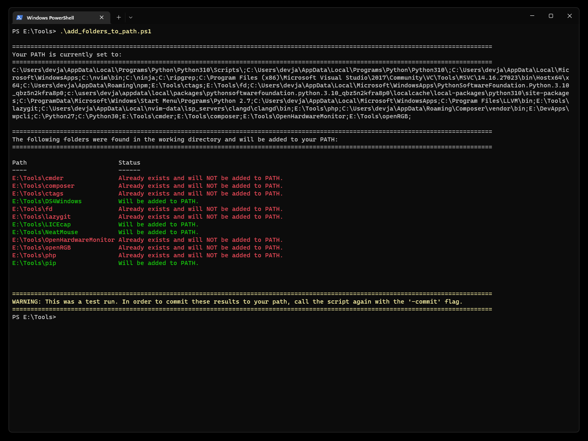

# Installation:
Grab the file from the repo, or use `wget`, `curl`, etc:

`curl https://raw.githubusercontent.com/jakemason/PATH-Adder/master/add_folders_to_path.ps1 -o add_folders_to_path.ps1`

# What does it do?
This utility will add all of the folders found in the working directory to your Windows' `$PATH` for the current User.

# Running:
Simply execute the `add_folders_to_path.ps1` script from the Windows 11 Terminal or a PowerShell in the desired directory. Note that the `-commit` flag must be passed for any changes to be made. I recommend you run it without the commit flag at first to review the changes that will be made. All subfolders found within `add_folders_to_path.ps1`'s directory will be added to your PATH.

Default call which does **not** cause changes: 

```.\add_folders_to_path.ps1```

Commit call which **will** cause changes: 

```.\add_folders_to_path.ps1 -commit```

# How/why is this useful? 
To save time / effort when installing tools on a new machine. I'll often find myself needing to install various tools (Python, fd, cmder, etc) that will all
need to be added to the user's `$PATH` to be useful. I've found that the easiest way to do that is to install all of these tools in the same folder leading to 
a directory structure similar to:

```
├── E:/tools/                          # The "parent" folder in which you'll want to run this script.
      └── fd/
      └── python/
      └── php/
      └── my_cool_tool/
      └── add_folders_to_path.ps1      # The script file featured in this repo
```

Additionally, I can just leave the script in place and run it again whenever my `E:/tools` directory is updated.

# Example Output:

## The default call allows you to preview what changes will be made:


## A '-commit' call which updates your $PATH:


# Safety Features

Note that your "old" $PATH will be written to a file titled 'old_path.txt' when the script is run with the `-commit` flag. This means you can always use that file to
reset your $PATH as it was before the update if it was run by mistake.
